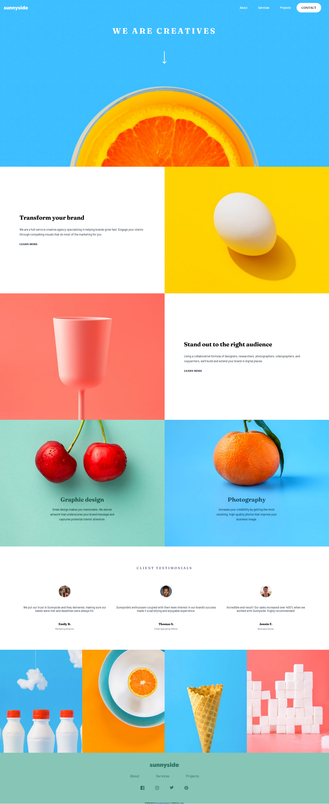

# Frontend Mentor - Sunnyside agency landing page solution

This is a solution to the [Sunnyside agency landing page challenge on Frontend Mentor](https://www.frontendmentor.io/challenges/sunnyside-agency-landing-page-7yVs3B6ef). Frontend Mentor challenges help you improve your coding skills by building realistic projects.

## Table of contents

- [Frontend Mentor - Sunnyside agency landing page solution](#frontend-mentor---sunnyside-agency-landing-page-solution)
  - [Table of contents](#table-of-contents)
  - [Overview](#overview)
    - [The challenge](#the-challenge)
    - [Screenshot](#screenshot)
    - [Links](#links)
  - [My process](#my-process)
    - [Built with](#built-with)
    - [What I learned](#what-i-learned)
    - [ tag and  usage](#-tag-and--usage)
    - [Aspect ratio usecase](#aspect-ratio-usecase)
    - [Testimonial syntax](#testimonial-syntax)
    - [Jumping to sections using CSS only](#jumping-to-sections-using-css-only)
    - [Click event on specific element](#click-event-on-specific-element)
    - [Continued development](#continued-development)
    - [Useful resources](#useful-resources)
  - [Author](#author)

## Overview

### The challenge

Users should be able to:

- View the optimal layout for the site depending on their device's screen size
- See hover states for all interactive elements on the page

### Screenshot



### Links

- Solution URL: [Add solution URL here](https://your-solution-url.com)
- Live Site URL: [Add live site URL here](https://your-live-site-url.com)

## My process

### Built with

- Semantic HTML5 markup
- CSS custom properties
- Flexbox
- CSS Grid
- Desktop-first workflow
- Javascript

### What I learned

### <a> tag and <button> usage

In general, use an <a> tag to handle navigation and a <button> to handle form submission and any other actions.

### Aspect ratio usecase

By adding aspect-ratio on grid items it is possible to change their height by maintaining the specified width-to-height ratio (aspect ratio).

```css
.section {
  aspect-ratio: 1.3;
  /* will make height a bit shorter than the width */
}
.img-container {
  aspect-ratio: 1.3;
  /* will make height a bit shorter than the width */
}
```

### Testimonial syntax

```html
<figure class="testimonial-2">
  
  <blockquote>
    Sunnyside’s enthusiasm coupled with their keen interest in our brand’s
    success made it a satisfying and enjoyable experience.
  </blockquote>
  <!-- here span or p element can be used -->
  <span class="testimonial-name">Thomas S.</span>
  <span class="testimonial-job">Chief Operating Officer</span>
</figure>
```

### Jumping to sections using CSS only

Using anchor element together with href and # symbol to jump to section with an id that has the same name. E.G. href="#about" jumps to id="about".

This anchor element...

```html
<li><a class="main-nav-link" href="#about">About</a></li>

...jumps to

<section id="about" class="section-I section-1"></section>
```

### Click event on specific element

Using event bubbling to perform event listener only when specific element is clicked (and not when other parent elements are clicked), checking if e.target === this.

```js
const modalClose = function (e) {
  if (e.target === this && !modalContainer.classList.contains("closed")) {
    modalContainer.classList.add("closed");
    headline.classList.remove("closed");
    console.log(e.target);
    console.log(this);
  }
};
pageTop.addEventListener("click", modalClose);
modalContainer.addEventListener("click", modalClose);
```

### Continued development

Try mobile-first approach.
Keep practicing

### Useful resources

- [Example resource 1](https://frontendcoding.com/button-or-anchor) - This helped me to understand usecases for anchor and button elements.
- [Example resource 2](https://www.freecodecamp.org/news/how-to-build-a-modal-with-javascript/) - This helped me with modal Javascript

## Author

- Frontend Mentor - [@lindasdesigns](https://www.frontendmentor.io/profile/lindasdesigns)
